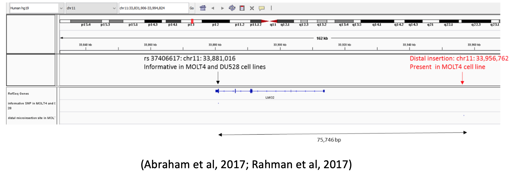

## Hapcounter

Minimal tool to count genotypic frequencies at two loci covered by same read fragments

### Usage

Takes position sorted BAM file along with the two genomic loci, and outputs the base counts at each loci, and genotype frequencies of same fragments spanning the two loci

```
$./hapcounter
Usage: hapcounter <bam> <region1> <region2> [qc:ture/false]
       hapcounter molt4LMO2.bam chr11:33881016 chr11:33956761
       hapcounter molt4LMO2.bam chr11:33881016 chr11:33956761 true
```

`QC = true` refers to removal reads with:

	* mapping quality < 30
	* is_mate_unmapped = false
	* is_secondary = false
	* is_supplementary = false

### Example



```rust
$./hapcounter molt4LMO2.bam chr11:33881015 chr11:33956761
Base counts at chr11:33881015-33881015
2794.0
A|T|G|C|INDELS
18(0.01)|2234(0.80)|140(0.05)|402(0.14)|0(0.00)
----------------------------
Base counts at chr11:33956761-33956761
534.0
A|T|G|C|INDELS
3(0.01)|1(0.00)|1(0.00)|237(0.44)|292(0.55)
----------------------------
Genotypes on fragments spanning chr11:33881015 and chr11:33956761 (Insert length 75746bp)
G/INDEL 15(0.05)
A/C     5(0.02)
G/C     2(0.01)
C/A     1(0.00)
C/T     1(0.00)
C/C     99(0.36)
C/INDEL 2(0.01)
T/INDEL 136(0.50)
T/G     1(0.00)
T/C     12(0.04)
```

50% of fragments with `T` at chr11:33881015 also contain an INDEL at chr11:33956761

### Installation

Requires [rust](https://www.rust-lang.org/tools/install)

```
$ git clone https://github.com/CompEpigen/hapcounter
$ cd hapcounter
$ cargo build --release
```

### caveat
Have not checked with Deletions.